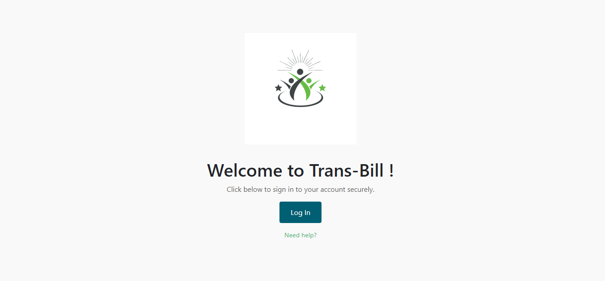
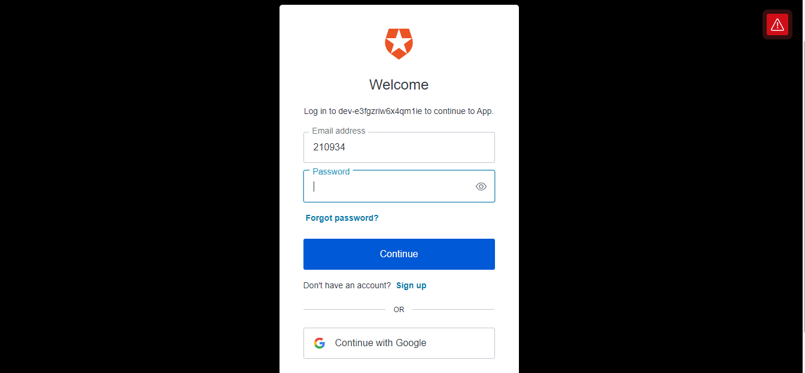
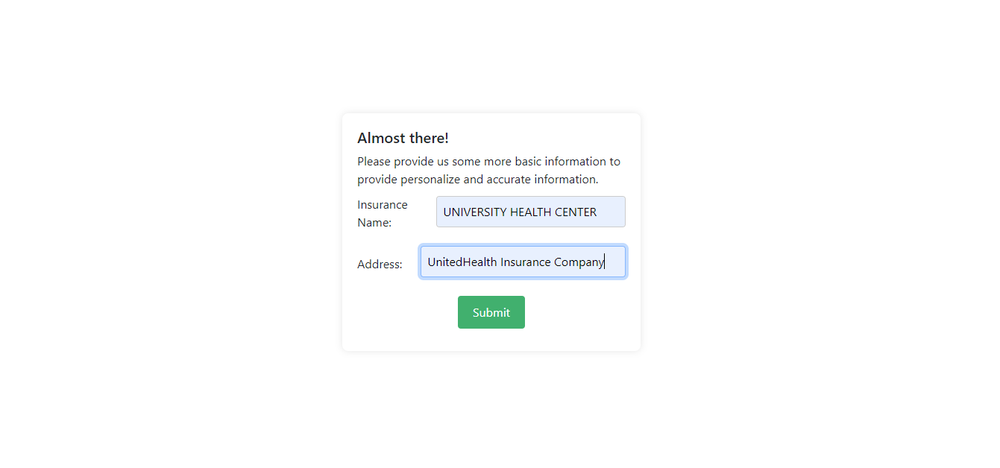
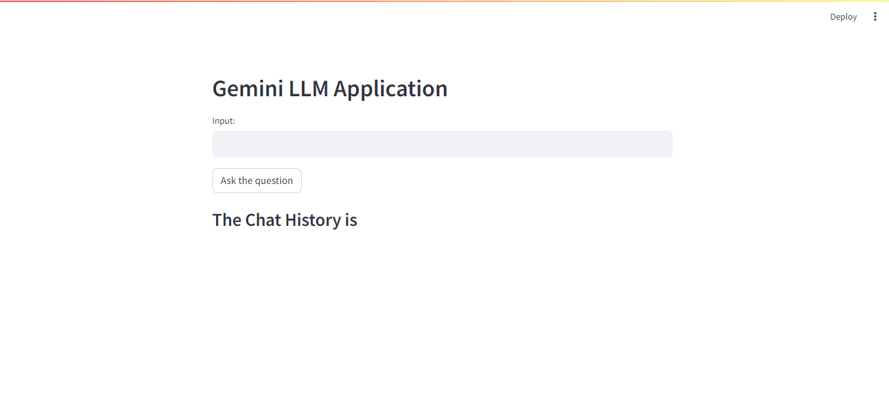
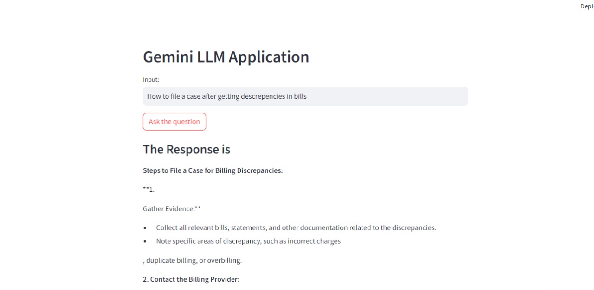

# ByteVerse_Hackhive

Our project aims to bring transparency in the medical billing system. Many individuals face unfair medical billing practices. Our app will empower patients to overcome this problem.

## Team Information

- **Team Name:** Hackhive
- **Institute Name:** National Institute of Technology, Patna

## Configuration of Web Application

### Technology Stack

This web application is built using the following technologies:

- **Frontend:**
  - React.js: A JavaScript library for building user interfaces.
  
- **Backend:**
  The backend is built with the following technologies:

  - **Python:**
    - NumPy: A library for numerical computing in Python.
    - Flask: A lightweight WSGI web application framework in Python.
    - PyTorch: A deep learning library for Python.
    
- **Database:**
  - MongoDB: A NoSQL database used for storing data in a flexible, JSON-like format.
  - SQL: [Specify the SQL database you're using here, e.g., MySQL, PostgreSQL, etc.]
  
- **Authentication:**
  - Auth0: A flexible authentication and authorization platform. [Here](https://auth0.com/).
  - 
  - 
  - 
  - 
  - 
  - 
  - 

## Dependencies and APIs Used

This project utilizes the following dependencies and APIs:

- **Google API:** You can access the Google API documentation [here](https://developers.google.com/docs/api).
- **Gemini API:** Integrated for Model Building. Learn more about the Gemini API [here](https://developer.gemini.com/).
- **MongoDB URL:** This project relies on MongoDB as the database. You can find more information about MongoDB [here](https://www.mongodb.com/).

## Available Scripts

In the project directory, you can run:

### `npm start`

Runs the app in the development mode.\
Open [http://localhost:3000](http://localhost:3000) to view it in your browser.

The page will reload when you make changes.\
You may also see any lint errors in the console.

### `npm run build`

Builds the app for production to the build folder.\
It correctly bundles React in production mode and optimizes the build for the best performance.

The build is minified and the filenames include the hashes.\
Your app is ready to be deployed!

See the section about [deployment](https://facebook.github.io/create-react-app/docs/deployment) for more information.

### `npm run eject`

*Note: this is a one-way operation. Once you eject, you can't go back!*

If you aren't satisfied with the build tool and configuration choices, you can eject at any time. This command will remove the single build dependency from your project.

Instead, it will copy all the configuration files and the transitive dependencies (webpack, Babel, ESLint, etc) right into your project so you have full control over them. All of the commands except eject will still work, but they will point to the copied scripts so you can tweak them. At this point you're on your own.

You don't have to ever use eject. The curated feature set is suitable for small and middle deployments, and you shouldn't feel obligated to use this feature. However, we understand that this tool wouldn't be useful if you couldn't customize it when you are ready for it.

To run the backend, open a new terminal and run the following command:

### `node server.js`

## Generative AI (Gemini_Gpt)

Generative AI or generative artificial intelligence refers to the use of AI to create new content, like text, images, music, audio, and videos.

This project is built with the following technologies:

- **Python:**
  - NumPy: A library for numerical computing in Python.
  - Flask: A lightweight WSGI web application framework in Python.
  - PyTorch: A deep learning library for Python.

### Streamlit

Streamlit is a Python library used for building interactive web applications for data science and machine learning projects. It allows you to create user interfaces for your Python scripts with minimal effort, mainly focusing on creating data-centric applications.
This is a new [**React Native**](https://reactnative.dev) project, bootstrapped using [`@react-native-community/cli`](https://github.com/react-native-community/cli).


## Configuration of Web Application


>**Note**: Make sure you have completed the [React Native - Environment Setup](https://reactnative.dev/docs/environment-setup) instructions till "Creating a new application" step, before proceeding.

## Step 1: Start the Metro Server

First, you will need to start **Metro**, the JavaScript _bundler_ that ships _with_ React Native.

To start Metro, run the following command from the _root_ of your React Native project:

```bash
# using npm
npm start

# OR using Yarn
yarn start
```

## Step 2: Start your Application

Let Metro Bundler run in its _own_ terminal. Open a _new_ terminal from the _root_ of your React Native project. Run the following command to start your _Android_ or _iOS_ app:

### For Android

```bash
# using npm
npm run android

# OR using Yarn
yarn android
```

### For iOS

```bash
# using npm
npm run ios

# OR using Yarn
yarn ios
```

If everything is set up _correctly_, you should see your new app running in your _Android Emulator_ or _iOS Simulator_ shortly provided you have set up your emulator/simulator correctly.

This is one way to run your app — you can also run it directly from within Android Studio and Xcode respectively.

## Step 3: Modifying your App

Now that you have successfully run the app, let's modify it.

1. Open `App.tsx` in your text editor of choice and edit some lines.
2. For **Android**: Press the <kbd>R</kbd> key twice or select **"Reload"** from the **Developer Menu** (<kbd>Ctrl</kbd> + <kbd>M</kbd> (on Window and Linux) or <kbd>Cmd ⌘</kbd> + <kbd>M</kbd> (on macOS)) to see your changes!

   For **iOS**: Hit <kbd>Cmd ⌘</kbd> + <kbd>R</kbd> in your iOS Simulator to reload the app and see your changes!

## Congratulations! :tada:

You've successfully run and modified your React Native App. :partying_face:

### Now what?

- If you want to add this new React Native code to an existing application, check out the [Integration guide](https://reactnative.dev/docs/integration-with-existing-apps).
- If you're curious to learn more about React Native, check out the [Introduction to React Native](https://reactnative.dev/docs/getting-started).

# Troubleshooting

If you can't get this to work, see the [Troubleshooting](https://reactnative.dev/docs/troubleshooting) page.

# For demo :https://drive.google.com/drive/folders/1jbe9z2RoUmZ98bjNA2S_HFLHnxZnEmQV?usp=sharing

# Learn More

To learn more about React Native, take a look at the following resources:

- [React Native Website](https://reactnative.dev) - learn more about React Native.
- [Getting Started](https://reactnative.dev/docs/environment-setup) - an **overview** of React Native and how setup your environment.
- [Learn the Basics](https://reactnative.dev/docs/getting-started) - a **guided tour** of the React Native **basics**.
- [Blog](https://reactnative.dev/blog) - read the latest official React Native **Blog** posts.
- [`@facebook/react-native`](https://github.com/facebook/react-native) - the Open Source; GitHub **repository** for React Native.


You can learn more in the [Create React App documentation](https://facebook.github.io/create-react-app/docs/getting-started).

To learn React, check out the [React documentation](https://reactjs.org/).

